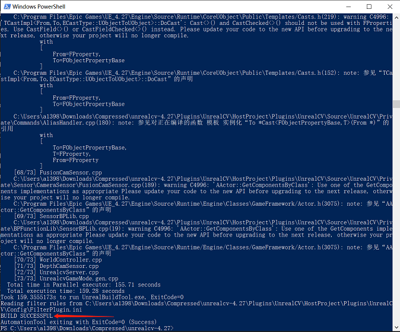
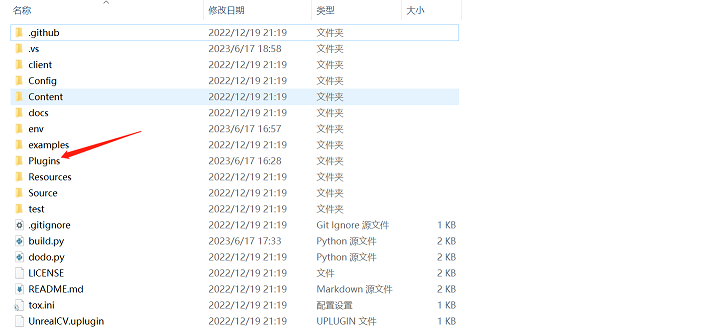

## UnrealEngine4：
1. Epic 官网下载**Epic Game Launcher** 链接:[下载Epic launcher](https://launcher-public-service-prod06.ol.epicgames.com/launcher/api/installer/download/EpicGamesLauncherInstaller.msi?productName=unrealEngine  "")       
2. 安装完成后需要点击虚幻引擎，安装UE4.27.2版本。   

## revit2020 Datasmith导出器
Unreal官网提供的datasmith导出器 安装到revit上。   
- 链接:[导出器下载页面，请选择UE4.27.2对应Revit版本的导出器下载（ue4.27最高支持到2022）](https://www.unrealengine.com/zh-CN/datasmith/plugins)
----------
## Unrealcv 插件：
### 1. 下载unrealcv，配置编译所需环境：
- unrealcv的获取：[github链接:branch建议使用4.27-stable](https://github.com/unrealcv/unrealcv/tree/4.27-stable)    
  点击**Code**下载源码到本地。   
  
- unrealcv的ue插件需要使用VisualStudio 编译C++文件 而且同时需要2017 和 2019版本  
  *VisualStudio历史版本下载链接*：  [VisualStudio2017](https://my.visualstudio.com/Downloads?q=visual%20studio%202019&wt.mc_id=o~msft~vscom~older-downloads)&[VisualStudio2019](https://my.visualstudio.com/Downloads?q=visual%20studio%202017&wt.mc_id=o~msft~vscom~older-downloads)
- 需要使用python运行**build.py**脚本, python需要安装unrealcv库   
  ```
  pip install -U unrealcv
  ```
### 2.源码的修正
> 来自于：[fix: cpp code to be compatible with 4.27](https://github.com/unrealcv/unrealcv/pull/234/commits/fc93ee4a89842fa25b902f6de1a99a97e41edcb5)
1. 使用VisualStudio打开unrealcv解压的源码文件夹点击显示所有文件
  
1. 找到*本地设置(.vs)*并作如下配置   
  - ***.vs\\ProjectSettings.json***
  ```json 
  {
    "CurrentProjectSetting": "No Configurations"
  }
  ```
  - ***.vs\\VSWorkspaceState.json***
  ```json 
  {
    "ExpandedNodes": [
      "",
      "\\Source",
      "\\Source\\UnrealCV",
      "\\Source\\UnrealCV\\Public",
      "\\Source\\UnrealCV\\Public\\Actor",
      "\\Source\\UnrealCV\\Public\\Component",
      "\\Source\\UnrealCV\\Public\\Sensor",
      "\\Source\\UnrealCV\\Public\\Sensor\\CameraSensor"
  ],
    "SelectedNode": "\\Source\\UnrealCV\\Public\\Actor\\StereoCameraActor.h",
    "PreviewInSolutionExplorer": false
  }
  ```
3. ***.\\Source\\UnrealCV\\Public***内的多个头文件需要修改  
  - ***.\\Actor\\StereoCameraActor.h***
  ```cpp 
  17 |
  18 | virtual void BeginPlay() override;
  19 |
  20-|UPROPERTY(EditInstanceOnly)
  20+|UPROPERTY(EditInstanceOnly, Category = "unrealcv")
  21 |float BaselineDistance;
  22 |
  23 |virtual TArray<FString> GetSensorNames() override;
  ```
  - ***.\\Component\\KeypointComponent.h***
  ```cpp {.line-nubers}
  42 |
  43-|UPROPERTY(EditAnywhere, BlueprintReadWrite)
  43+|UPROPERTY(EditAnywhere, BlueprintReadWrite, Category = "unrealcv")
  44 |FString JsonFilename;
  45 |
  46-|UPROPERTY(EditAnywhere, BlueprintReadWrite)
  46+|UPROPERTY(EditAnywhere, BlueprintReadWrite, Category = "unrealcv")
  47 |bool bVisualize;
  48 |
  49-|UPROPERTY(EditAnywhere, BlueprintReadWrite)
  49+|UPROPERTY(EditAnywhere, BlueprintReadWrite, Category = "unrealcv")
  50 |float VisualizePointSize;
  51 |
  52-|UPROPERTY(EditAnywhere, BlueprintReadWrite)
  52+|UPROPERTY(EditAnywhere, BlueprintReadWrite, Category = "unrealcv")
  53 |bool bMatchNearestVertex;
  54 |
  55-|UPROPERTY(EditAnywhere, BlueprintReadWrite)
  55+|UPROPERTY(EditAnywhere, BlueprintReadWrite, Category = "unrealcv")
  56 |bool bDrawKeypointName;
  57 |
  58 |UFUNCTION(BlueprintPure, Category = "unrealcv")
  ```
  - .\\Sensor\\CameraSensor\\FusionCamSensor.h
  ```cpp 
  // Weichao Qiu @ 2017
1   |#pragma once
2  +|#include "Runtime/Engine/Classes/Components/PrimitiveComponent.h"
3   |#include "Runtime/Engine/Classes/Camera/CameraTypes.h"
4   |#include "FusionCamSensor.generated.h"
5   |

117 |private:
118-|   UPROPERTY(EditInstanceOnly, meta=(AllowPrivateAccess = "true"))
118+|   UPROPERTY(EditInstanceOnly, meta=(AllowPrivateAccess = "true"), Category = "unrealcv")
119-|   EPresetFilmSize PresetFilmSize;
120 |
121-|   UPROPERTY(EditInstanceOnly, meta=(AllowPrivateAccess = "true"))
121+|   UPROPERTY(EditInstanceOnly, meta=(AllowPrivateAccess = "true"), Category = "unrealcv")
122 |   int FilmWidth;
123 |
124-|   UPROPERTY(EditInstanceOnly, meta=(AllowPrivateAccess = "true"))
124+|   UPROPERTY(EditInstanceOnly, meta=(AllowPrivateAccess = "true"), Category = "unrealcv")
125 |   int FilmHeight;
126 |   
127-|   UPROPERTY(EditInstanceOnly, meta=(AllowPrivateAccess = "true"))
127+|   UPROPERTY(EditInstanceOnly, meta=(AllowPrivateAccess = "true"), Category = "unrealcv")
128 |   float FOV;
129 |
130 |protected:
131 |   UPROPERTY()
132 |   TArray<class UBaseCameraSensor*> FusionSensors;
133 | 
134-|   UPROPERTY(EditDefaultsOnly)
134+|   UPROPERTY(EditDefaultsOnly, Category = "unrealcv")
135 |   class UDepthCamSensor* DepthCamSensor;
136 |
137-|   UPROPERTY(EditDefaultsOnly)
137+|   UPROPERTY(EditDefaultsOnly, Category = "unrealcv")
138 |   class UNormalCamSensor* NormalCamSensor;
139 |
140-|   UPROPERTY(EditDefaultsOnly)
140+|   UPROPERTY(EditDefaultsOnly, Category = "unrealcv")
141 |   class UAnnotationCamSensor* AnnotationCamSensor;
142 | 
143-|   UPROPERTY(EditDefaultsOnly)
143+|   UPROPERTY(EditDefaultsOnly, Category = "unrealcv")
144 |   class ULitCamSensor* LitCamSensor;
146 |   
  ```
   - .\\Sensor\\CameraSensor\\DepthCamSensor.h
  ```cpp
17 |{ 
18 |  virtual void InitTextureTarget(int FilmWidth, int FilmHeight) override;
19 |
20-|  UPROPERTY(EditInstanceOnly)
20+|  UPROPERTY(EditInstanceOnly, Category = "unrealcv")
21 |bool bIgnoreTransparentObjects;
22 |};
  ```
### 3.编译出可用的uerealcv插件
- 使用终端(命令提示符*or***PwerShell***or***其他的终端**)运行源码内的***build.py***
  
- 得到的插件在***plugins***文件夹内
  
--------------------
## Camera 360 v2   
>官方文档链接:ps ***非常的不好用***   
[Documents of Camera 360 v2](https://docs.google.com/document/d/1HPTUJrr-wJS5duPureXfXnT51vi5wFZl-0wh10Gn0IU/edit)

1. 将插件添加到UE蓝图项目文件夹中的*Plugin*文件夹中
2. 打开项目在选项中启用Cemera360v2插件   
   
-------    
没法使用官方的sequencer渲染方法得到全景照片：   
1.play状态下sequencer渲染器无法启动。  
       
2.开启渲染后无法输入unrealcv命令得到分割图像
- 解决方法：   
step 1. 使用play状态下的**Cubemap FaceBook(3x2)**的play视角得到所需图像  
step 2. 使用camera360v2**Highresshot In Editor**截图功能直接输出图片——在[*raw*](raw)文件夹中  
step 3. 使用opencv库对所得图像进行切片，划分为6个视角——输出到[*6rotation*](6rotation)文件夹中
          
--------   


### 注意：
1.需要先导入datasmith模型，再打开unrealcv,否则将有部分物体无法输出颜色信息